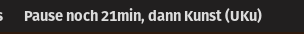
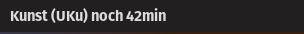
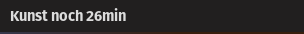
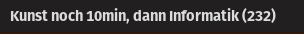
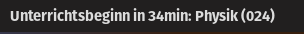
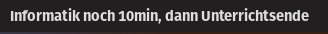

## Timetable Status

This project is used to display the current state of my timetable during school in my GNOME desktop environment.

To do this, the [Executor](https://github.com/raujonas/executor) Desktop Extensions runs the `currenStatus.js` script in
this directory.
This will log a value to the console which gets displayed in my desktop environment.

Please note that the committed timetable and structure data is outdated and modified to protect my privacy.

This project is not actively maintained or supported, I build this during a few lessons to make it easier for me to view
relevant parts of my timetable in school.

## Examples

